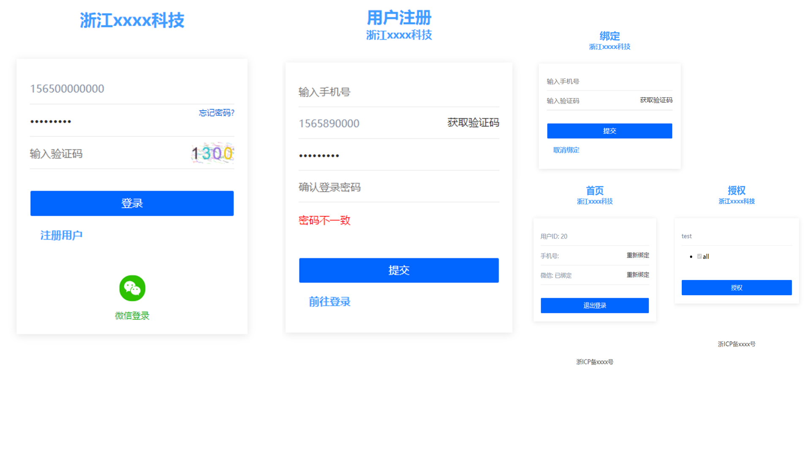

# 基于 Spring Security OAuth 的统一账号管理平台



演示地址: https://tao.flizi.cn

账号: 123456, 密码: 123456

## 功能

- OAuth2 密码登录,添加图形验证码 (开发完成)
- OAuth2 授权码登录 (开发完成)
- OAuth2 刷新TOKEN (开发完成)
- 微信登录 (开发完成)
- 短信登录 (开发完成)

## 文档

- [项目地址](https://github.com/taoroot/oauth2-server)
- [接口文档](./doc/api.md)
- [Spring Security 过滤器总体架构分析](./doc/filter.md)
- [Spring OAuth2 前世今生](./doc/history.md)

## 技术栈:

- Spring Boot
- Spring Security
- Spring Security OAuth2
- Mybatis

## 环境依赖:

- JRE1.8
- Mysql5.7

## 配置说明

- 配置数据库

```yaml
spring:
  datasource:
    driver-class-name: com.mysql.cj.jdbc.Driver
    username: root
    password: root
    url: jdbc:mysql://127.0.0.1:3306/auth?useUnicode=true&characterEncoding=utf-8&serverTimezone=GMT%2B8
```

- 配置微信登录

公众平台用于在微信**内置浏览器**打开时登录

开放平台用于在非微信环境下**扫码登录**

```yaml
social:
  wx-mp: # 微信公众平台
    key: xxxx
    secret: xxx
  wx-open: # 微信开放平台
    key: xxxx
    secret: xxx
```

- 配置图形验证码

```yaml
captcha:
  enable: true # 启用
  base-str: '0123' #  随机字符
  length: 4  #  长度
```

- 配置手机验证码(腾讯云)

```yaml
sms:
  enable: true # 启用
  secretId: 'xxxx'
  secretKey: 'xxxx'
  appId: 'xxx'
  sign: 'xxx'
  templateId: 'xxx'
```

- 页面配置

```yaml
baseinfo:
  title: 浙江xxxx科技 # 标题
  beian: 浙ICP备xxxx号 # 备案号
```

# 编译 & 部署
```shell
mvn package && java -jar auth-0.0.1.jar
```