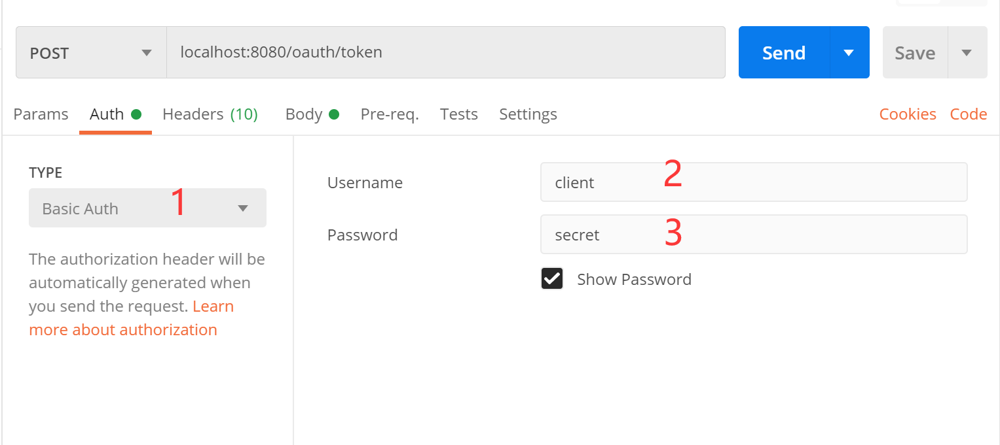
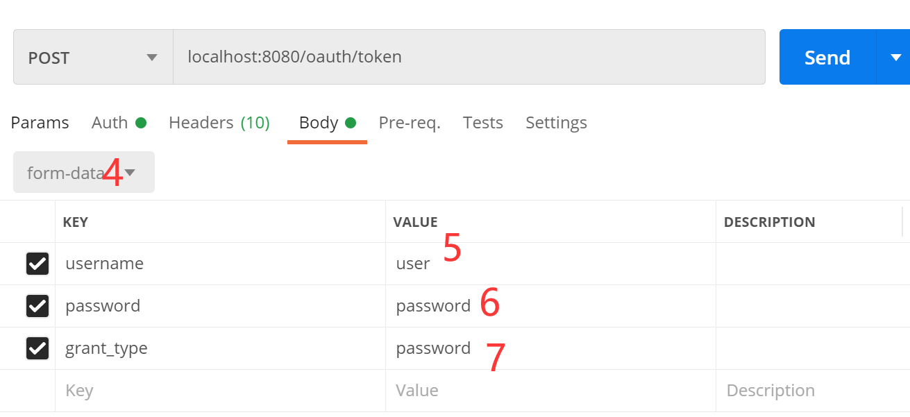

# 接口文档

{xxx} 表示是一个参数变量

## 图形验证码

```http
GET /captcha?key={timestamp} HTTP/1.1
```
## 手机验证码

```http
GET /sms?phone={phone} HTTP/1.1
```

## OAuth2 授权码
```http
GET /oauth/authorize?client_id={client_id}&redirect_uri={redirect_uri}&response_type={response_type}&scope={scope}&state={state} HTTP/1.1
```

## OAuth2 密码登录

扩展支持图形验证码,提高接口安全性

captchaKey: 图形验证码key, captchaCode: 图形验证码

```http
POST /oauth/token HTTP/1.1
Authorization: Basic {Base64({client_id};{secret})}
Content-Type: application/x-www-form-urlencoded

grant_type=password&username={username}&password={password}&scope={scope}&captchaKey={captchaKey}&captchaCode={captchaCode}
```

## OAuth2 授权码登录

```http
POST /oauth/token HTTP/1.1
Authorization: Basic {Base64({client_id};{secret})}
Content-Type: application/x-www-form-urlencoded

grant_type=authorization_code&code={code}&scope={scope}
```

## 手机号,微信登录

```
if (type == 'sms')
    code = '手机验证码'
if (type == 'WX_MP')
    code = '微信公众平台授权码'
if (type == 'WX_OPEN')
    code = '微信开放平台授权码'
```

```http
POST /oauth/token HTTP/1.1
Authorization: Basic {Base64({client_id};{secret})}
Content-Type: application/x-www-form-urlencoded

grant_type=social&type={type}&code={code}&scope={scope}
```


## 登录成功
```json
{
    "access_token": "access_token",
    "token_type": "bearer",
    "expires_in": 43199,
    "scope": "read_user",
    "user_id": "11"
}
```


## 获取用户信息

```http
GET /user_base HTTP/1.1
Authorization: Bearer {access_token}
```

scope!=all
```json
{
  "msg": "SUCCESS",
  "code": "SUCCESS",
  "name": "xxxxx"
}
```

scope==all
```json
{
  "msg": "SUCCESS",
  "code": "SUCCESS",
  "phone": "xxx",
  "name": "xxx",
  "email": "xxxx"
}
```

# Postman


